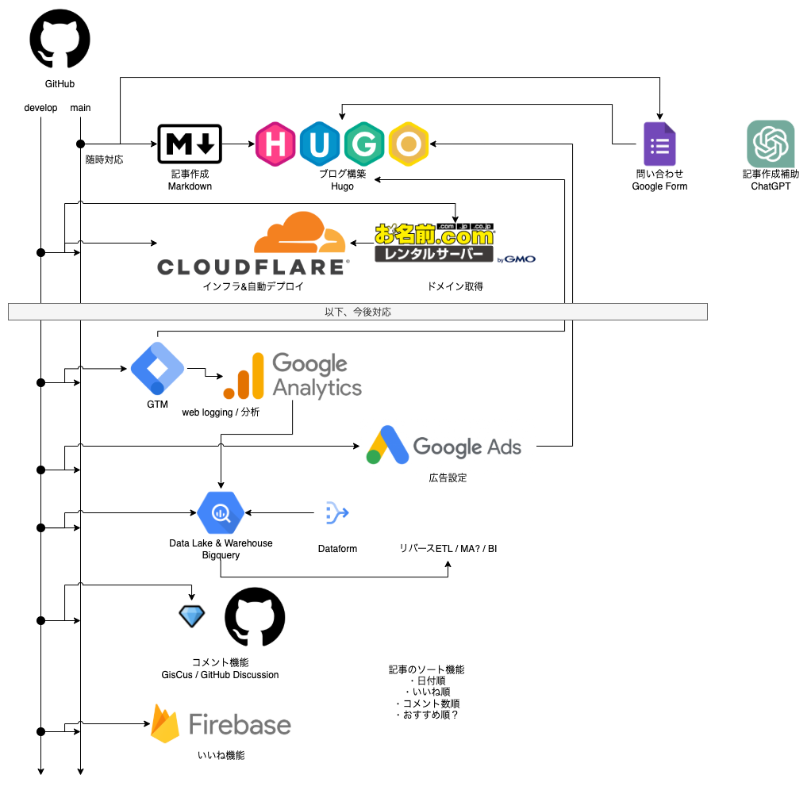

# ぢぴ氏の育児奮闘記

## ブランチの運用について

記事の更新、システムの更新、改修、
アップデートは`develop`ブランチで行い、プルリクエストで`main`に反映します。

## ブログ更新方法

以下のコマンドにて、ローカルでの確認ができます。
確認してください！

```bash
hugo server -D
```

### プロフィールページを作る

初期設定は以下(内容は書いていくこと)。

```bash
hugo new about.md
```

### プライバシーポリシーの作成

初期設定は以下(内容は適宜アップデートすること)。

```bash
hugo new privacy.md
```

### お問い合わせページの作成

初期設定は以下(内容は適宜アップデートすること)。

```bash
hugo new contact.md
```

### 投稿の追加

毎回mdファイルのタイトルを考えて、作成していくこと。

```bash
hugo new posts/first-post.md
```

## 構成図



## 初期設定

Macで以下を設定
(GitHubでのベースの設定が完了している前提)。

```bash
brew install hugo
hugo new site zipishi-blog
cd zipishi-blog
git submodule add https://github.com/adityatelange/hugo-PaperMod.git themes/PaperMod
touch config.toml
rm hugo.toml
```

```bash
hugo server -D
```

## Gemini CLI による GitHub Actions の設定と PR レビュー

**Gemini より引用**

###  Gemini CLI GitHub Actionsを利用する
Googleが公式に提供しているGemini CLI GitHub Actionsを利用するのが最も手軽で強力な方法です。これは、リポジトリにセットアップするだけで、自動でPRレビューやIssueのトリアージを行ってくれるものです。

**特徴**
無料利用枠あり: Gemini APIには、1日あたり1,500リクエストまでの無料利用枠があります。個人のプロジェクトでPRレビューに利用する程度であれば、この無料枠に十分収まる可能性が高いです。

- PRレビューの自動化: 新しいPRが作成されると、Geminiが自動的にコードをレビューし、フィードバックや改善案をコメントしてくれます。
- オンデマンドのレビュー: `@gemini-cli /review` のようなコメントで、必要なときにレビューを依頼することもできます。

### セットアップ手順

1. Gemini APIキーの取得:
[Google AI Studio](https://aistudio.google.com/apikey)にアクセスして、APIキーを取得します。

2. GitHubリポジトリにAPIキーを登録:

GitHubのリポジトリの`Settings > Secrets and variables > Actions`に移動します。

New repository secretをクリックし、名前を**GEMINI_API_KEY**、値に取得したAPIキーを設定します。

3.  GitHub Actionsのワークフローを作成:
リポジトリのルートに.github/workflowsディレクトリを作成し、pr-review.ymlのような名前でファイルを作成します。

- [実際のworkflows](.github/workflows/pr-review.yml)
- [参考にした公式ページ](https://github.com/google-gemini/gemini-cli-action/blob/main/examples/gemini-pr-review.yml)
