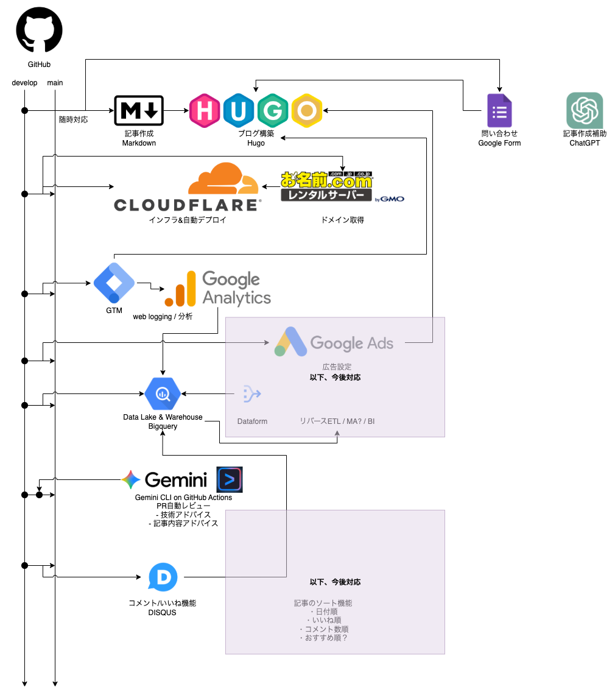

# プロジェクトドキュメント概要

このディレクトリにはプロジェクトに関するガイドがまとまっています。新しく参加する方は以下のドキュメントから読み始めると良いでしょう。

## ブランチの運用について

記事の更新、システムの更新、改修、
アップデートは`develop`ブランチで行い、プルリクエストで`main`に反映します。

## 関連ドキュメント

- [プロジェクト構造や運用の基本](CONTRIBUTING.md)
- [ブログ更新方法](blog-posting.md)
- [プルリクエストの作成と承認](pull-request.md)
- [その他必要なページの作成](other-pages.md)
- [初期設定](setup.md)
- [Gemini CLI による GitHub Actions の設定と PR レビュー](gemini-cli.md)

## 構成図

