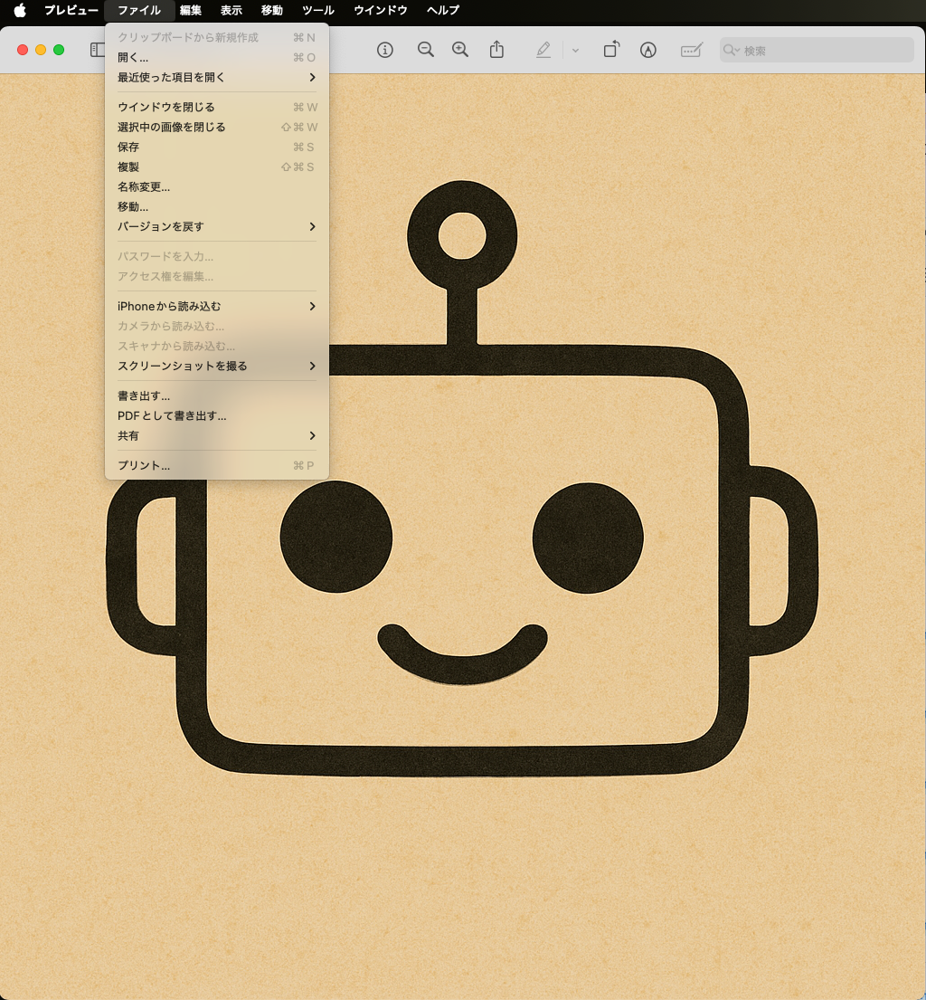
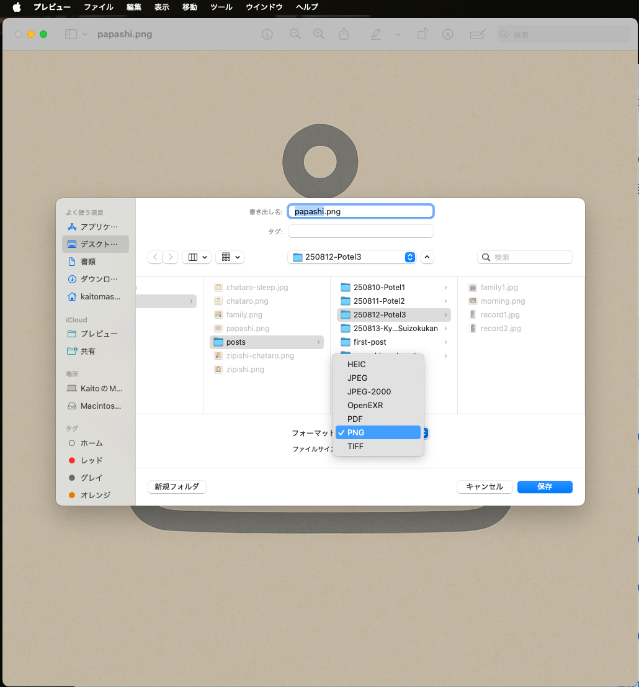
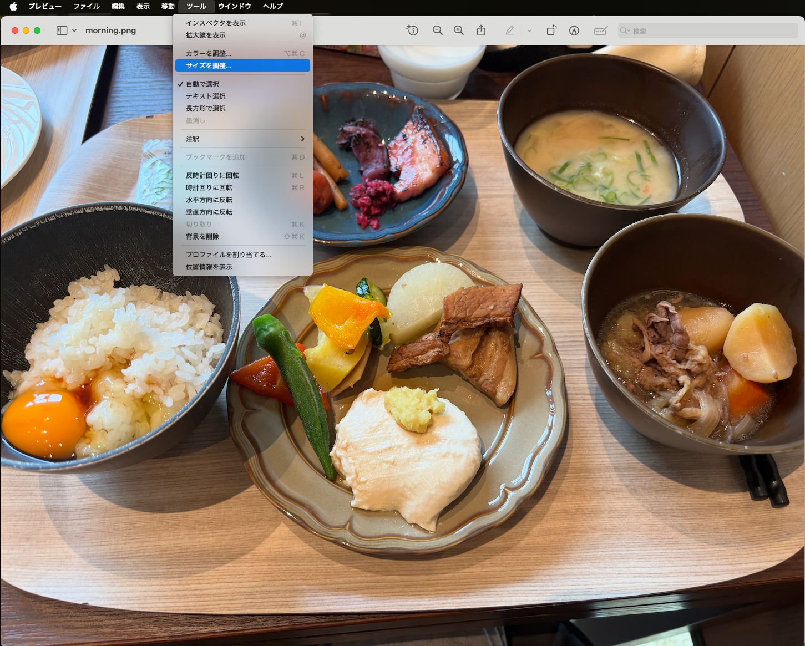
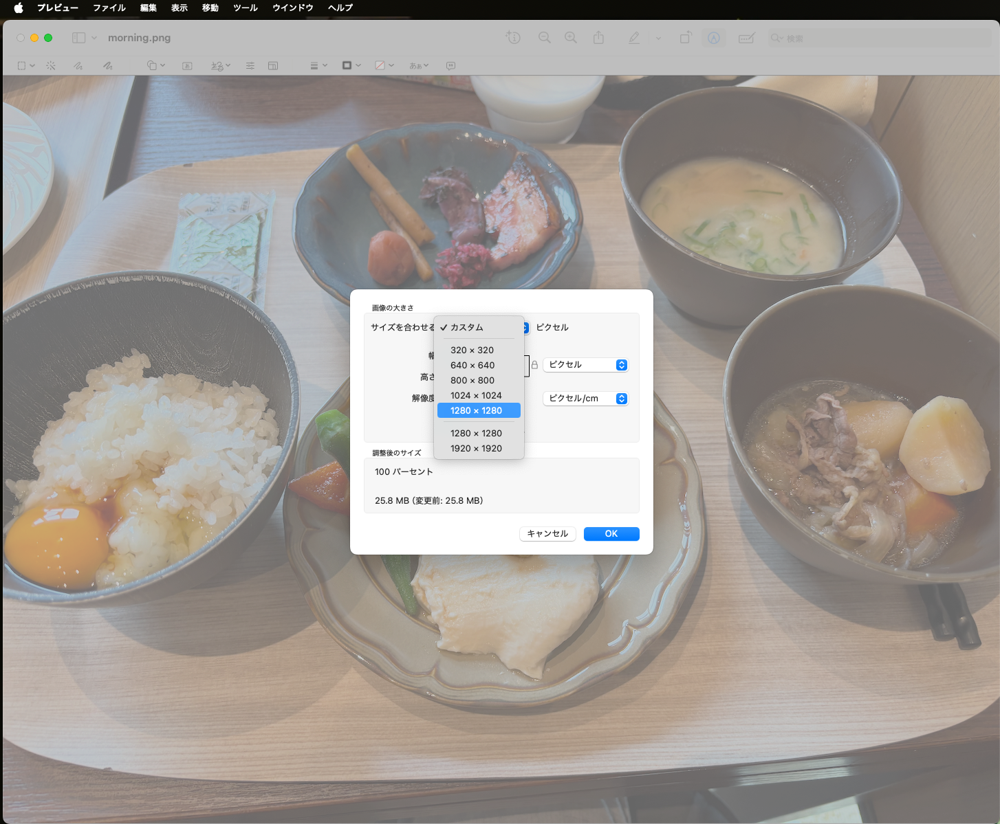
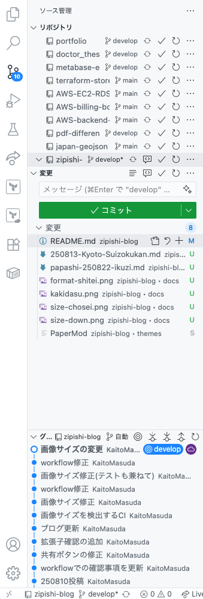
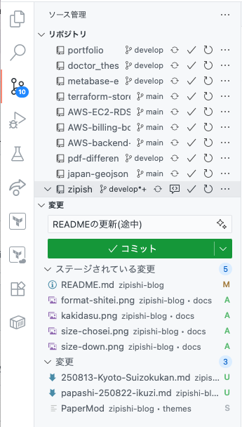
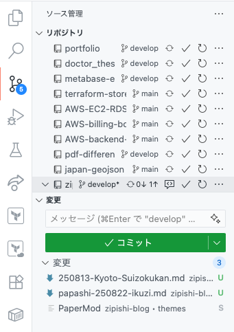

# ブログ更新方法

記事作成、ローカルでの確認、GitHub への push 、develop ブランチから main ブランチへの
反映と公開 (プルリクエスト、通称プルリク)を順に丁寧に説明していきます。

また、前提として
- 記事作成・ GitHub への push は VS Code
- Macbook を利用 (ターミナルを利用)
- プルリクはブラウザのGitHubを使用
とします。

## 記事作成

まずはブログの記事を作っていきましょう。

### 記事の情報を書く

`content/posts/`のフォルダの中に、過去に公開している記事があるので、コピーしてファイル名を変更しましょう(`.md`は必要です)。

その後、VSCodeを開きます。

上の部分がタイトルとかタグとかのメタ情報になります。以下は例です。

```bash
---
title: "やっほー！"
cover:
  image: "/images/posts/yaho/yaho.jpg"
  alt: "やっほー！のアイキャッチ"
  caption: ""
  relative: false
  hiddenInSingle: true
date: 2025-08-XXT21:30:00+09:00
lastmod: 2025-08-XXT21:30:00+09:00
tags: ["育児", "0歳", "旅行"]
categories: ["日記"]
Author: "ぢぴ氏"
draft: false
---
```

- title: タイトルです
- cover: ブログ一覧に見える画像の写真です
- date: 作成日です
- lastmod: 更新日です。書かないとGitHubに上げた日時が反映されたりします
- tags: タグです。タグ検索が可能になります
- categories: カテゴリーです。カテゴリー検索が可能になります。タグより大きい括りなイメージ
- Author: 筆者です
- draft: falseで本番公開です。基本falseでOK。

### 文章を書く

VSCodeで引き続き編集できます。
文字の後に半角スペース2つや2回の改行で段落を作れます。

シャープ記号を(重ねて)入れると、タイトルの大きさをつけられます。

```bash
# 大タイトルだよ
## 中タイトルだよ
### 小タイトルだよ
```

以下の記号で挟むと、太文字になります。

```bash
**あ**
```

以下の線を入れると、ブログ内にも区切りが入ります。

```bash
---
```

あとは、顔文字やキャラクター性があるといいでしょう。

そのほか、「Hugo md 記事書き方」とか色々調べるといいと思います。
表も入れられたり、斜体とかできるはず。多分。

### 画像を入れる

**画像はできる限り入れていきましょう**

HEICの場合、jpgかpngにする必要があります。
手順は以下です。

1. 画像(ブログに入れるものは大抵`static`にあります)をMacのプレビューで開く
2. 左上の「ファイル」から「書き出す」をクリックします
   
3. 下の画像のようになるので、「フォーマット」を「jpg」か「png」で指定します。また、適切な場所に保存してください
   

写真サイズも25MB以上だとブログに「上がらない」のと「重たい」です。
以下の手順で変更してください。

1. フォルダで画像サイズを順次確認し、ファイルサイズの大きい画像を確認しましょう
2. サイズを変えたい画像(ブログに入れるものは大抵`static`にあります)をMacのプレビューで開く
3. 左上の「ツール」から「サイズの調整」をクリックします
   
3. 下の画像のようになるので、「1028」あたりを指定します
   

ちなみに、画像サイズを確認してくれる機能をつけています
(Image Size Check and Guard: `image-guard.yml`というのでGitHubが監視、教えてくれます)。

最後に、データが増えてくると丁寧に管理されていたら後ほどめちゃ助かるので、拡張子は小文字で統一してください
(Extension and Naming Policy Check: `extension-check.yml`というのでGitHubが監視、教えてくれます)。

### リンクを入れる

**リンクは積極的に貼っていきましょう**

外部リンクは以下のような書き方でいけます。外部に飛ばすので、リンク間違えに気をつけましょう。

公式ページやSNSあたりのリンクは一度調べておくといいかもしれません。

``` bash
[A](URL)
```

ブログ内の他の記事は以下のような書き方でいけます。

他の記事に誘導することで、いろんな記事を読んでもらいたいですね。

``` bash
[B](/posts/B/)
```

## Hugo によるローカルでの確認

ターミナルを開きます。
ターミナルでは、`cd`コマンドを使って、
`zipishi-blog`の階層まで移動します。

```bash
cd Desktop/GitHub/zipishi-blog
```

以下のコマンドにて、ローカル環境での確認ができます。

```bash
hugo server -D
```

`localhost:1313`にアクセスしてください。
見え方が確認できます。

## GitHub への push

記事が一通り書き終わったら、GitHubというサイトに書いた記事や画像を上げます。
ここでは、公開ではなく、**公開のための下準備**になります。めんどくさいかもしれませんが、
問題がないか確認してくれる機能もあるので、頑張りましょう！

以下、手順です。

1. VSCodeで編集し終えたら、下の画像のところに移動します(ブランチの枝分かれしたマーク、「zipishi-blog」を選択)。
   
2. 変更したい記事を「プラスボタン(+)」で選択してください。変更内容も日本語で入れておきましょう。途中でも全然OKですよ(公開しなければ)。
   
3. 「コミット」をクリックします(上画像の緑色のところ)。
4. 上の方の「ブランチ名」の右横の雲のボタン、アップロードをクリックしましょう。
   

これで、GitHubには上がっている状態になります。

この作業はブログの更新記事や変更単位で実施しましょう。
また、後続作業も細かく分けて実施することをオススメします。

**まとめて一気に変更すると、後でどこでどういった変更をしたのか、また、より戻しが難しくなります！**

※GitHubに上げているコードをローカルで見れるように`git clone`する初期設定はネットで調べるか個別に聞いてください。

さらにさらに、他の人が色々と作業した結果、ブログの構成が更新されているときがあります。
GitHubに上がっているものが最新のものになるので、ローカルの環境と揃えておくことをオススメします。
「ブランチ名」の右横の「循環矢印」のボタンを押すことを推奨しておきます(以下画像のところ参照)。


次は [プルリクエストの作成と承認](pull-request.md) をご覧ください。
