# プルリクエスト (プルリク) の作成と承認 (公開)

[ブログ更新方法](blog-posting.md)から続きます。

ここまできたら、あとはブラウザのGitHubの中でプルリクを送って最終チェックをして公開になります。

1. GitHubで`zipishi-blog`のレポジトリに移動する
2. 上のタブの「Pull requests」をクリックする(もしくは上の方に出てくる「Compare & Pull request」でもOK。こちらの場合は4番へ)
   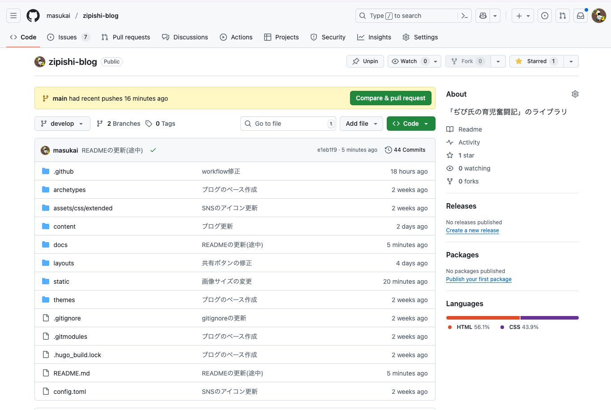
3. 真ん中右の「New pull request」をクリック
   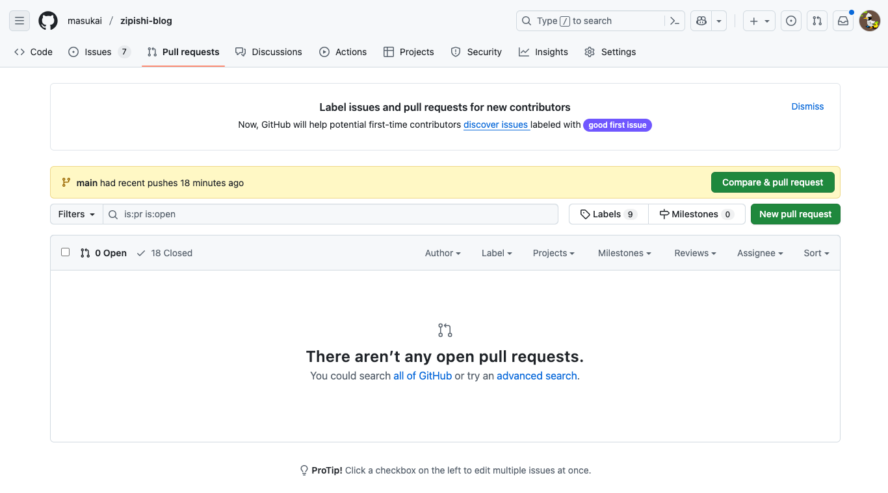
4. `develop`から`main`のブランチに矢印が成るように選択(2から直接来た場合、逆になっていることがあるので、注意)。その後、右側の「Create pul request」をクリック
   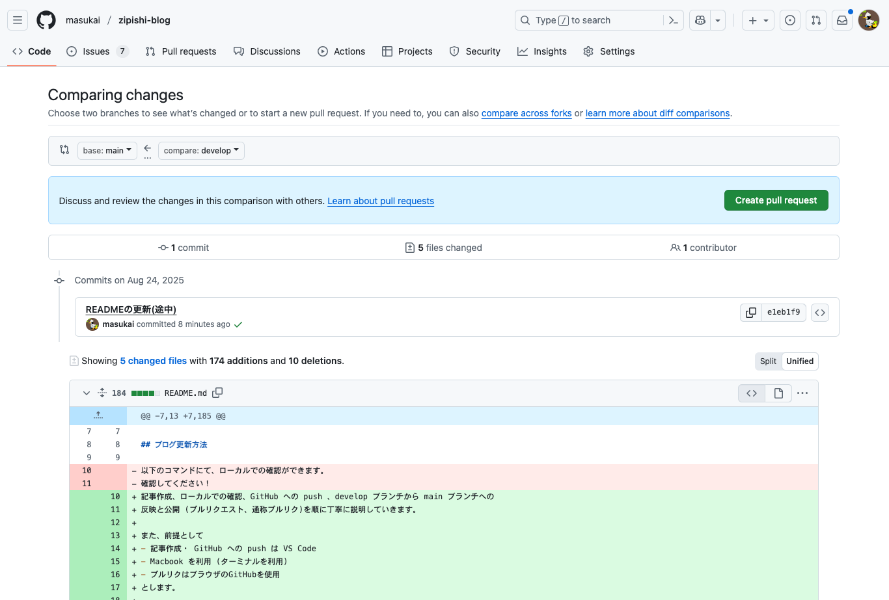
5. タイトルや変更内容を書いていきます(本当はReviewerの設定やAssigneesとかあっていいのですが、今は簡略化)。その後、`Create pull request`をクリック
   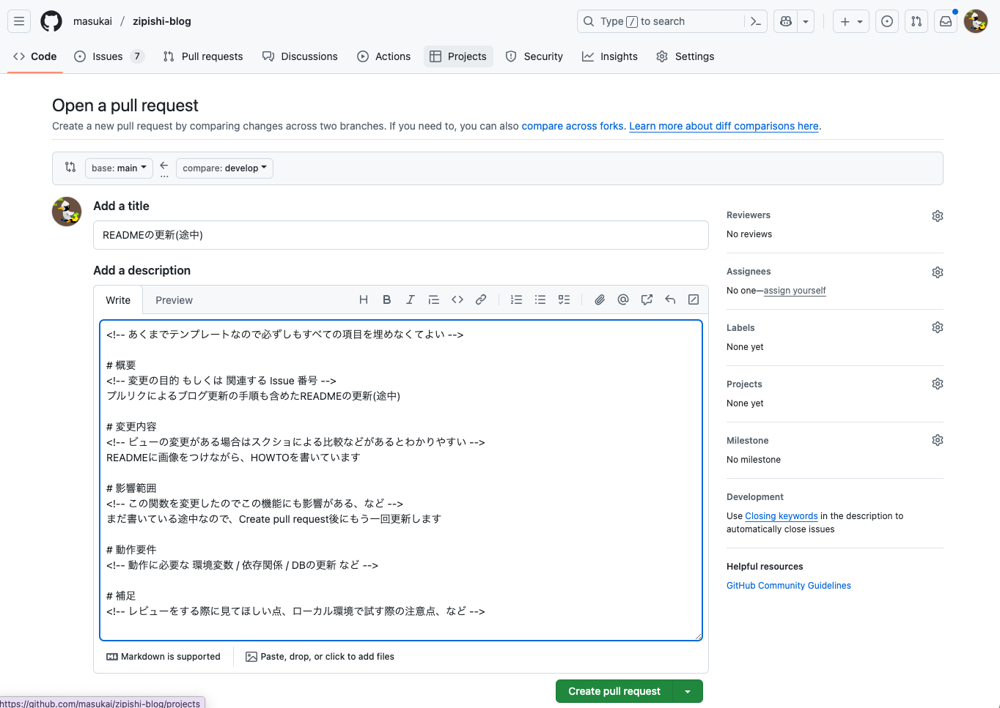
6. 以下の画像のように、プルリクがOpenになります。また、自動でGemini CLIがレビューをくれます(1~2分後)。そのほか、チェックするCIが走っているので、全て緑色のチェックになればOKです。赤のバツになった場合、どこかしらにエラーがあるので、それぞれ詳細をみるようにしましょう。わからなければ聞いてもらえればOK。
   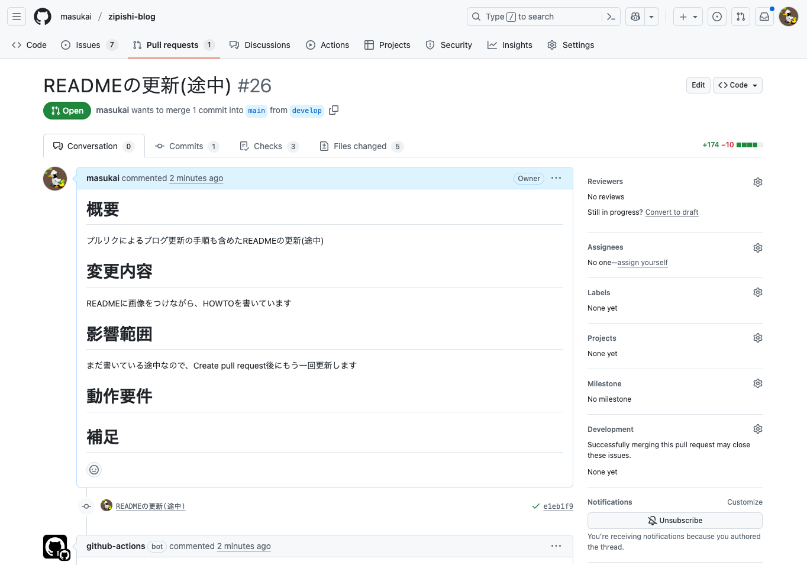
   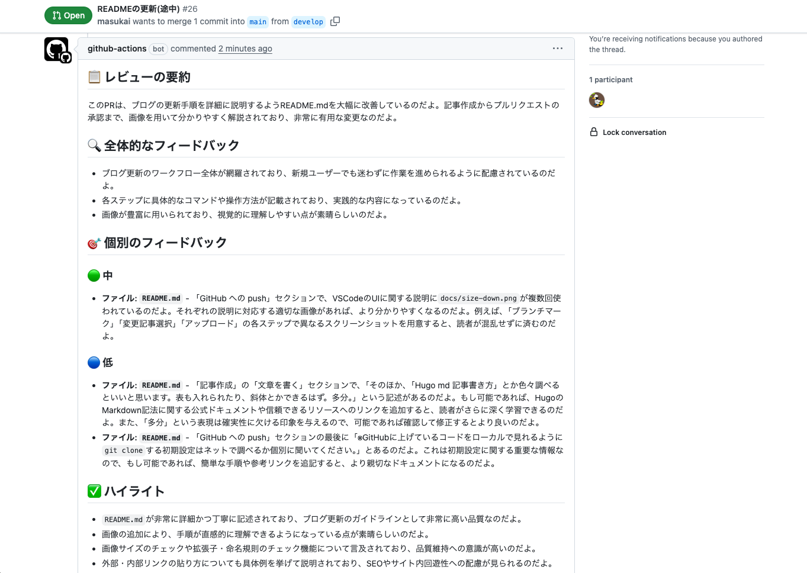
   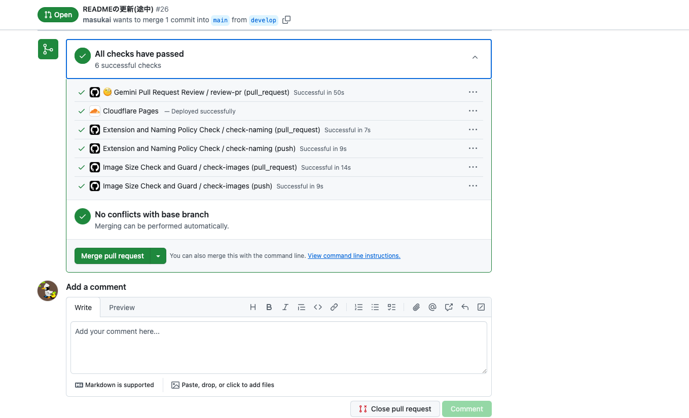
7. 今回みたいに、更新が途中だったり、エラーがある場合は、ブログ更新方法の「GitHub への push」に書いてある内容のように、ローカルで修正を行い、GitHubにpushしてください。`develop`ブランチから`main`ブランチへのマージのプルリクになっている場合、`develop`に上げるだけで、更新内容が追加されます。
   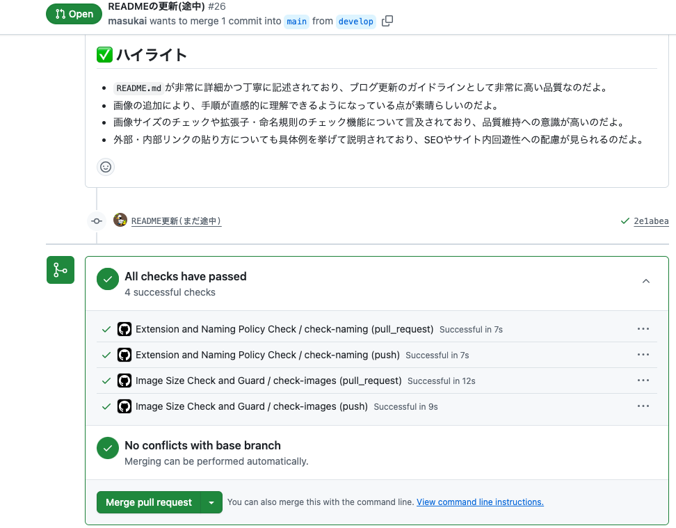
8. 追加でGemini CLIのコメントが欲しくなった場合は、コメントに`@gemini-cli /review`と入れましょう。以下のようにコメントをくれます。
   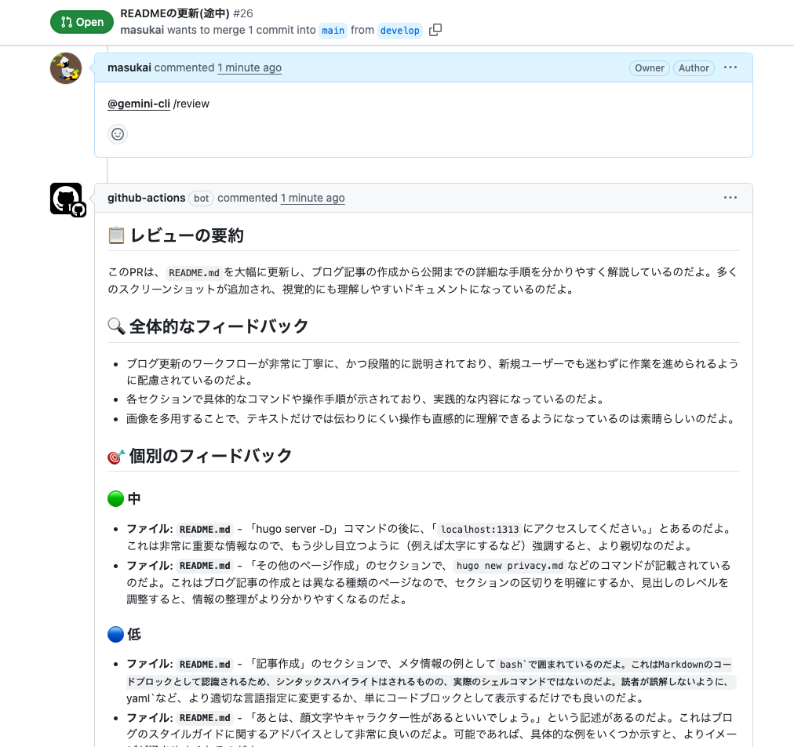
9. 更新内容が確定したら、最後に緑色の「Merge pull request」のボタンをクリックし、「confirm merge」をクリックします。これで無事記事は公開されました！
   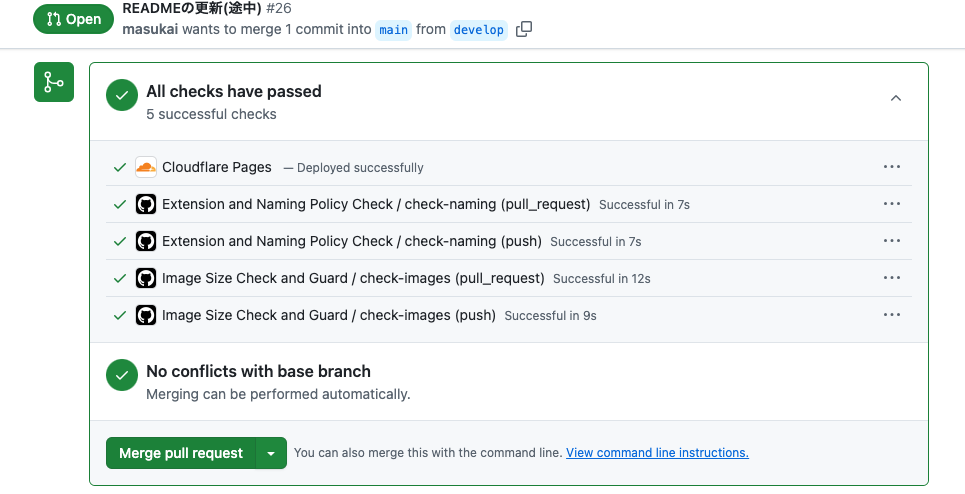
   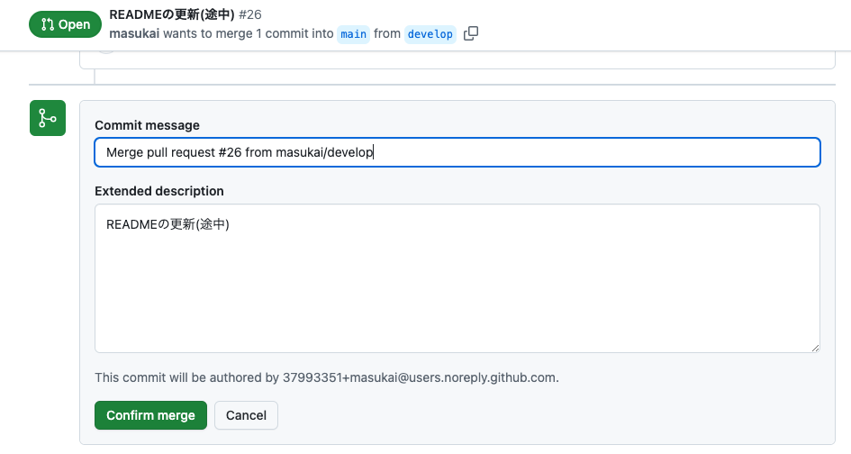

